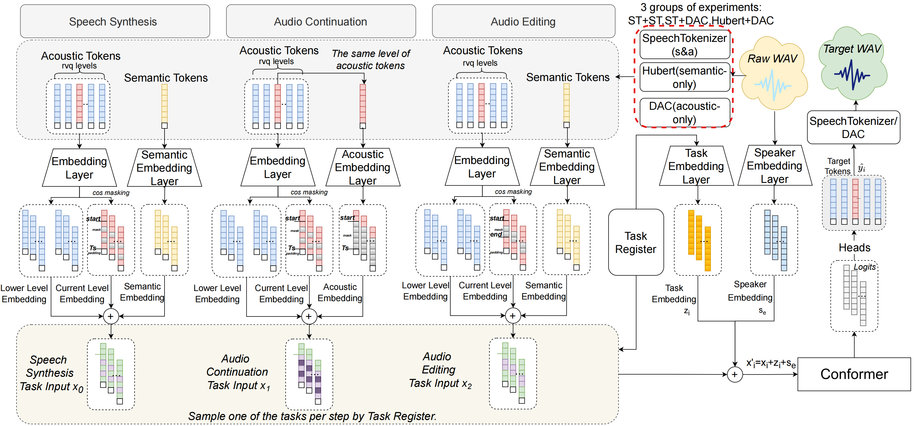

  <h2>Introduction</h2>

Recent advancements in non-autoregressive single-task speech generation have garnered significant attention. However, traditional single-task speech synthesis methods primarily focus on mapping semantic tokens to acoustic tokens, overlooking the internal relationships within acoustic features. Addressing this gap, we introduce SpeechSEC, a unified multi-task framework designed for Speech Synthesis, Editing, and Continuation tasks by dynamically adjusting input conditions. SpeechSEC not only enhances speech synthesis performance in terms of speech intelligibility, audio quality, and voice preservation by acquiring shared and diverse knowledge across different tasks, but also efficiently executes editing and continuation tasks with high performance via non-autoregressive techniques. Additionally, SpeechSEC exhibits strong adaptability to current speech discretization methods, such as HuBERT, Descript-Audio-Codec, and SpeechTokenizer, showcasing the robustness of our approach.

  

  <h2>Model Structure</h2>

  

  <h2>Contribution</h2>

- We enhance speech synthesis performance through multi-task joint training, improving intelligibility, voice preservation, and audio quality while ensuring fast execution via non-autoregressive methods.
- We present a unified multi-task framework for efficient, high-quality speech synthesis, editing, and continuation, offering innovation in audio processing.
- We demonstrate the adaptability and robustness of our multi-task joint training method across various semantic and acoustic token extraction methods, proving its broad applicability.

  

  <h2>Demos</h2>

Here are some demos of our speech synthesis system. You can click the audio files below to listen to examples.

### SpeechSEC_SpeechSynthesis

Includes samples and results for the speech synthesis task, demonstrating how SpeechSEC framework can be used to generate speech with a specific voice.

  <audio controls>
    <source src="./demo-main/demo-main/1_SpeechSEC_SpeechSynthesis/1.wav" type="audio/wav">
    Your browser does not support the audio element.
  </audio>
  <audio controls>
    <source src="./demo-main/demo-main/1_SpeechSEC_SpeechSynthesis/2.wav" type="audio/wav">
    Your browser does not support the audio element.
  </audio>
  <audio controls>
    <source src="./demo-main/demo-main/1_SpeechSEC_SpeechSynthesis/3.wav" type="audio/wav">
    Your browser does not support the audio element.
  </audio>
  <audio controls>
    <source src="./demo-main/demo-main/1_SpeechSEC_SpeechSynthesis/4.wav" type="audio/wav">
    Your browser does not support the audio element.
  </audio>
  <audio controls>
    <source src="./demo-main/demo-main/1_SpeechSEC_SpeechSynthesis/5.wav" type="audio/wav">
    Your browser does not support the audio element.
  </audio>
    <audio controls>
    <source src="./demo-main/demo-main/1_SpeechSEC_SpeechSynthesis/6.wav" type="audio/wav">
    Your browser does not support the audio element.
  </audio>
  <audio controls>
    <source src="./demo-main/demo-main/1_SpeechSEC_SpeechSynthesis/7.wav" type="audio/wav">
    Your browser does not support the audio element.
  </audio>
  <audio controls>
    <source src="./demo-main/demo-main/1_SpeechSEC_SpeechSynthesis/8.wav" type="audio/wav">
    Your browser does not support the audio element.
  </audio>
  <audio controls>
    <source src="./demo-main/demo-main/1_SpeechSEC_SpeechSynthesis/9.wav" type="audio/wav">
    Your browser does not support the audio element.
  </audio>
  <audio controls>
    <source src="./demo-main/demo-main/1_SpeechSEC_SpeechSynthesis/10.wav" type="audio/wav">
    Your browser does not support the audio element.
  </audio>
    <audio controls>
    <source src="./demo-main/demo-main/1_SpeechSEC_SpeechSynthesis/11.wav" type="audio/wav">
    Your browser does not support the audio element.
  </audio>
  <audio controls>
    <source src="./demo-main/demo-main/1_SpeechSEC_SpeechSynthesis/12.wav" type="audio/wav">
    Your browser does not support the audio element.
  </audio>
  <audio controls>
    <source src="./demo-main/demo-main/1_SpeechSEC_SpeechSynthesis/13.wav" type="audio/wav">
    Your browser does not support the audio element.
  </audio>

 

### SpeechSEC_SpeechEditing

This directory contains samples and results for the speech editing task, showcasing SpeechSEC's capability to make detailed edits on speech segments while maintaining coherence and clarity.

<table class="edit_table">
  <tr>
    <th>Original</th>
    <th>Edit_Add</th>
    <th>Edit_Remove</th>
  </tr>
  <tr>
    <td>
      <audio controls>
        <source src="./demo-main/demo-main/2_SpeechSEC_SpeechEditing/1_Original.wav" type="audio/wav">
        Your browser does not support the audio element.
      </audio>
      
Hello dear paper reviewer, wish you glad.

    </td>
    <td>
      <audio controls>
        <source src="./demo-main/demo-main/2_SpeechSEC_SpeechEditing/1_Edit_Add.wav" type="audio/wav">
        Your browser does not support the audio element.
      </audio>
       
Hello dear <b>smart and professional</b> paper reviewer, wish you glad.

    </td>
    <td>
      <audio controls>
        <source src="./demo-main/demo-main/2_SpeechSEC_SpeechEditing/1_Edit_Remove.wav" type="audio/wav">
        Your browser does not support the audio element.
      </audio>
       
Hello dear <s>paper</s> reviewer, wish you glad.

    </td>
  </tr>
  <tr>
    <td>
      <audio controls>
        <source src="./demo-main/demo-main/2_SpeechSEC_SpeechEditing/2_Original.wav" type="audio/wav">
        Your browser does not support the audio element.
      </audio>
      
They still draw about it in history classes

    </td>
    <td>
      <audio controls>
        <source src="./demo-main/demo-main/2_SpeechSEC_SpeechEditing/2_edit_add_a_funny_and_impressive.wav" type="audio/wav">
        Your browser does not support the audio element.
      </audio>
      
They still draw about it in a <b>funny and impressive</b> history classes

    </td>
    <td>
      <audio controls>
        <source src="./demo-main/demo-main/2_SpeechSEC_SpeechEditing/2_edit_replace_history_biology.wav" type="audio/wav">
        Your browser does not support the audio element.
      </audio>
      
They still draw about it in <b>biology</b> classes

    </td>
  </tr>
  <tr>
    <td>
      <audio controls>
        <source src="./demo-main/demo-main/2_SpeechSEC_SpeechEditing/3_Original.wav" type="audio/wav">
        Your browser does not support the audio element.
      </audio>
      
Mr.Sprague realize the trouble, quickly threw off the current, stop the engine

    </td>
    <td>
      <audio controls>
        <source src="./demo-main/demo-main/2_SpeechSEC_SpeechEditing/3_edit_add_andCallThePolice.wav" type="audio/wav">
        Your browser does not support the audio element.
      </audio>
      
Mr.Sprague realize the trouble, quickly threw off the current, stop the engine and <b>call the police</b>.

    </td>
    <td>
      <audio controls>
        <source src="./demo-main/demo-main/2_SpeechSEC_SpeechEditing/3_edit_delete_quickly.wav" type="audio/wav">
        Your browser does not support the audio element.
      </audio>
      
Mr.Sprague realize the trouble, <s>quickly</s> threw off the current, stop the engine

       <audio controls>
        <source src="./demo-main/demo-main/2_SpeechSEC_SpeechEditing/3_edit_replace_slowly.wav" type="audio/wav">
        Your browser does not support the audio element.
      </audio>
      
Mr.Sprague realize the trouble, <b>slowly</b> threw off the current, stop the engine

    </td>
  </tr>
</table>

 

### SpeechSEC_SpeechContinuation

This folder showcases the application of SpeechSEC in the speech continuation task, demonstrating how to generate natural continuations of human speech based on a given segment.

  <table>
   <tr>
    <th>Original</th>
    <th>Speech Continuation</th>
  </tr>
    <tr>
      <td>
        <audio controls>
          <source src="./demo-main/demo-main/3_SpeechSEC_SpeechContinuation/1.wav" type="audio/wav">
          Your browser does not support the audio element.
        </audio>
        
A beautiful plane is flying in the sky

      </td>
      <td>
        <audio controls>
          <source src="./demo-main/demo-main/3_SpeechSEC_SpeechContinuation/1_ContinueResult.wav" type="audio/wav">
          Your browser does not support the audio element.
        </audio>
      </td>
    </tr>
    <tr>
      <td>
        <audio controls>
          <source src="./demo-main/demo-main/3_SpeechSEC_SpeechContinuation/2.wav" type="audio/wav">
          Your browser does not support the audio element.
        </audio>
        
I left him collapsed in the chair

      </td>
      <td>
        <audio controls>
          <source src="./demo-main/demo-main/3_SpeechSEC_SpeechContinuation/2_ContinueResult.wav" type="audio/wav">
          Your browser does not support the audio element.
        </audio>
      </td>
    </tr>
    <tr>
      <td>
        <audio controls>
          <source src="./demo-main/demo-main/3_SpeechSEC_SpeechContinuation/3.wav" type="audio/wav">
          Your browser does not support the audio element.
        </audio>
        
Mr.Sprague realize the trouble, quickly threw   off the current, stop the engine

      </td>
      <td>
        <audio controls>
          <source src="./demo-main/demo-main/3_SpeechSEC_SpeechContinuation/3_ContinueResult.wav" type="audio/wav">
          Your browser does not support the audio element.
        </audio>
      </td>
    </tr>
  </table>

