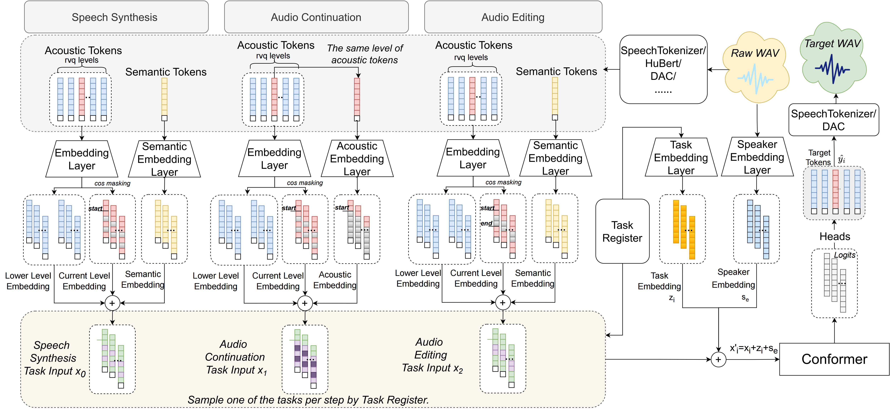

  <h2>Introduction</h2>

Recent advancements in non-autoregressive audio generation have garnered significant attention. However, traditional single-task speech synthesis methods focus primarily on mapping semantic tokens to acoustic tokens, overlooking the internal relationships within acoustic features. Addressing this gap, we introduce SpeechSEC, a unified multi-task framework designed for Speech Synthesis, Editing, and Continuation tasks by dynamically adjusting input conditions. SpeechSEC not only enhances speech synthesis performance in speech intelligibility, audio quality, and voice preservation by acquiring shared and diverse knowledge across different tasks, but also efficiently executes editing and continuation tasks with good performance via non-autoregressive techniques. Additionally, SpeechSEC exhibits a strong adaptability to current speech discretization methods, like Hubert, Descript-Audio-Codec, and SpeechTokenizer, which showcases the robustness of our approach. Audio samples are available.

  

  <h2>Model Structure</h2>

  

  <h2>Contribution</h2>

- We improve speech synthesis performance through multi-task joint training in aspects including speech intelligibility, voice preservation, audio quality with fast speed utilizing non-autoregressive methods.
- We propose a multi-task audio processing framework that can efficiently accomplish high-quality speech synthesis, speech editing and speech continuation tasks in a non-autoregressive manner through a single unified model, bringing innovation to the field of audio processing.
- We verify the adaptability of different discretion methods of speech processing and demonstrated that the multi-task joint training method we proposed is effective for different extractors of semantic tokens and acoustic tokens which showcases the wide applicability and robustness of our method.

  

  <h2>Demos</h2>

Here are some demos of our speech synthesis system. You can click the audio files below to listen to examples.

### SpeechSEC_SpeechSynthesis

  <audio controls>
    <source src="https://raw.githubusercontent.com/CL0077/SpeechSEC/gh-pages/docs/demo-main/demo-main/1_SpeechSEC_SpeechSynthesis/1.wav" type="audio/wav">
    Your browser does not support the audio element.
  </audio>
  <audio controls>
    <source src="https://raw.githubusercontent.com/CL0077/SpeechSEC/gh-pages/docs/demo-main/demo-main/1_SpeechSEC_SpeechSynthesis/2.wav" type="audio/wav">
    Your browser does not support the audio element.
  </audio>
  <audio controls>
    <source src="https://raw.githubusercontent.com/CL0077/SpeechSEC/gh-pages/docs/demo-main/demo-main/1_SpeechSEC_SpeechSynthesis/3.wav" type="audio/wav">
    Your browser does not support the audio element.
  </audio>
  <audio controls>
    <source src="https://raw.githubusercontent.com/CL0077/SpeechSEC/gh-pages/docs/demo-main/demo-main/1_SpeechSEC_SpeechSynthesis/4.wav" type="audio/wav">
    Your browser does not support the audio element.
  </audio>
  <audio controls>
    <source src="https://raw.githubusercontent.com/CL0077/SpeechSEC/gh-pages/docs/demo-main/demo-main/1_SpeechSEC_SpeechSynthesis/5.wav" type="audio/wav">
    Your browser does not support the audio element.
  </audio>

 

### SpeechSEC_SpeechEditing

<table>
  <tr>
    <th>Original</th>
    <th>Edit_Add</th>
    <th>Edit_Remove</th>
  </tr>
  <tr>
    <td>
      <audio controls>
        <source src="https://raw.githubusercontent.com/CL0077/SpeechSEC/gh-pages/docs/demo-main/demo-main/2_SpeechSEC_SpeechEditing/1_Original.wav" type="audio/wav">
        Your browser does not support the audio element.
      </audio>
    </td>
    <td>
      <audio controls>
        <source src="https://raw.githubusercontent.com/CL0077/SpeechSEC/gh-pages/docs/demo-main/demo-main/2_SpeechSEC_SpeechEditing/1_Edit_Add.wav" type="audio/wav">
        Your browser does not support the audio element.
      </audio>
    </td>
    <td>
      <audio controls>
        <source src="https://raw.githubusercontent.com/CL0077/SpeechSEC/gh-pages/docs/demo-main/demo-main/2_SpeechSEC_SpeechEditing/1_Edit_Remove.wav" type="audio/wav">
        Your browser does not support the audio element.
      </audio>
    </td>
  </tr>
  <tr>
    <td>
      <audio controls>
        <source src="https://raw.githubusercontent.com/CL0077/SpeechSEC/gh-pages/docs/demo-main/demo-main/2_SpeechSEC_SpeechEditing/2_Original.wav" type="audio/wav">
        Your browser does not support the audio element.
      </audio>
    </td>
    <td>
      <audio controls>
        <source src="https://raw.githubusercontent.com/CL0077/SpeechSEC/gh-pages/docs/demo-main/demo-main/2_SpeechSEC_SpeechEditing/2_edit_add_a_funny_and_impressive.wav" type="audio/wav">
        Your browser does not support the audio element.
      </audio>
    </td>
    <td>
      <audio controls>
        <source src="https://raw.githubusercontent.com/CL0077/SpeechSEC/gh-pages/docs/demo-main/demo-main/2_SpeechSEC_SpeechEditing/2_Edit_Remove.wav" type="audio/wav">
        Your browser does not support the audio element.
      </audio>
    </td>
  </tr>
  <tr>
    <td>
      <audio controls>
        <source src="https://raw.githubusercontent.com/CL0077/SpeechSEC/gh-pages/docs/demo-main/demo-main/2_SpeechSEC_SpeechEditing/3_Original.wav" type="audio/wav">
        Your browser does not support the audio element.
      </audio>
    </td>
    <td>
      <audio controls>
        <source src="https://raw.githubusercontent.com/CL0077/SpeechSEC/gh-pages/docs/demo-main/demo-main/2_SpeechSEC_SpeechEditing/3_Edit_Add.wav" type="audio/wav">
        Your browser does not support the audio element.
      </audio>
    </td>
    <td>
      <audio controls>
        <source src="https://raw.githubusercontent.com/CL0077/SpeechSEC/gh-pages/docs/demo-main/demo-main/2_SpeechSEC_SpeechEditing/3_Edit_Remove.wav" type="audio/wav">
        Your browser does not support the audio element.
      </audio>
    </td>
  </tr>
</table>

 

### SpeechSEC_SpeechContinuation

  <!-- 第一行 2 个音频 -->
  <audio controls>
    <source src="https://raw.githubusercontent.com/CL0077/SpeechSEC/gh-pages/docs/demo-main/demo-main/3_SpeechSEC_SpeechContinuation/1.wav" type="audio/wav">
    Your browser does not support the audio element.
  </audio>
  <audio controls>
    <source src="https://raw.githubusercontent.com/CL0077/SpeechSEC/gh-pages/docs/demo-main/demo-main/3_SpeechSEC_SpeechContinuation/1_ContinueResult.wav" type="audio/wav">
    Your browser does not support the audio element.
  </audio>

  <!-- 第一行 2 个音频 -->
  <audio controls>
    <source src="https://raw.githubusercontent.com/CL0077/SpeechSEC/gh-pages/docs/demo-main/demo-main/3_SpeechSEC_SpeechContinuation/2.wav" type="audio/wav">
    Your browser does not support the audio element.
  </audio>
  <audio controls>
    <source src="https://raw.githubusercontent.com/CL0077/SpeechSEC/gh-pages/docs/demo-main/demo-main/3_SpeechSEC_SpeechContinuation/2_ContinueResult.wav" type="audio/wav">
    Your browser does not support the audio element.
  </audio>

  <!-- 第二行 2 个音频 -->
  <audio controls>
    <source src="https://raw.githubusercontent.com/CL0077/SpeechSEC/gh-pages/docs/demo-main/demo-main/3_SpeechSEC_SpeechContinuation/3.wav" type="audio/wav">
    Your browser does not support the audio element.
  </audio>
  <audio controls>
    <source src="https://raw.githubusercontent.com/CL0077/SpeechSEC/gh-pages/docs/demo-main/demo-main/3_SpeechSEC_SpeechContinuation/3_ContinueResult.wav" type="audio/wav">
    Your browser does not support the audio element.
  </audio>

